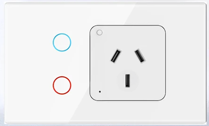

## General Notes

A smart GPO the contains 2 light switches. All three outputs are controllable.

These devices are sold under many brands on Aliexpress.

Copy


## GPIO Pinout

| Pin    | Function                   |
| ------ | -------------------------- |
| P0     | Bottom Button Blue LED (H) |
| P6     | Top Button Relay L2 (H)    |
| P7     | Top Button Blue LED (H)    |
| P8     | Top Button (L)             |
| P9     | Status LED RED (H)         |
| P10    | Bottom Button (L)          |
| P11    | GPO Button (L)             |
| P24    | Bottom Button Relay L1 (H) |
| P26    | GPO Relay (H)              |

The light output relays are connected to the RED button LED.

You can turn the button LED purple by turning on the blue LED while the RED is on.

## Configuration

```yaml
## -----------------------##
## Substitution Variables ##
## -----------------------##
substitutions:
  device_friendly_name: GPO Switch
  device_internal_name: GPO Switch
## --------------------##
## Board Configuration ##
## --------------------##
esphome:
  name: ${device_internal_name}
  friendly_name: ${device_friendly_name}

bk72xx:
  board: generic-bk7231t-qfn32-tuya
## ---------------- ##
##  Binary Sensors  ##
## ---------------- ##
binary_sensor:
# Top Button
  - platform: gpio
    id: button_1
    pin:
      number: P8
      inverted: true
      mode: INPUT_PULLUP
    on_press:
      then:
        - light.toggle: light1
    internal: True
  
# Bottom Button
  - platform: gpio
    id: button_2
    pin:
      number: P10
      inverted: true
      mode: INPUT_PULLUP
    on_press:
      then:
        - light.toggle: light2
    internal: True

# Button 3(GPO)
  - platform: gpio
    id: button_3
    pin:
      number: P11
      inverted: true
      mode: INPUT_PULLUP
## ---------------- ##
##      Switch      ##
## ---------------- ##
switch:
#GPO
  - platform: gpio
    pin: P26
    name: ${device_friendly_name}
    id: relay
    restore_mode: always on   # default when power is turned on
    icon: mdi:power-socket-au

#Button LED (RED)
  - platform: gpio
    id: Top_buttonLED
    pin:
      number: P7

  - platform: gpio
    id: Bottom_buttonLED
    pin:
      number: P0

## ---------------- ##
##      Relays      ##
## ---------------- ##
output:
# Relay L1
  - platform: gpio
    id: relay1
    pin: P6
# Relay L2
  - platform: gpio
    id: relay2
    pin: P24
## ------------ ##
##    Lights    ##
## ------------ ##
light:
# Light L1
  - platform: binary
    name: ${device_friendly_name}_1
    icon: ${device_icon}
    output: relay1
    id: light1
# Light L2
  - platform: binary
    name: ${device_friendly_name}_2
    icon: ${device_icon}
    output: relay2
    id: light2
```
